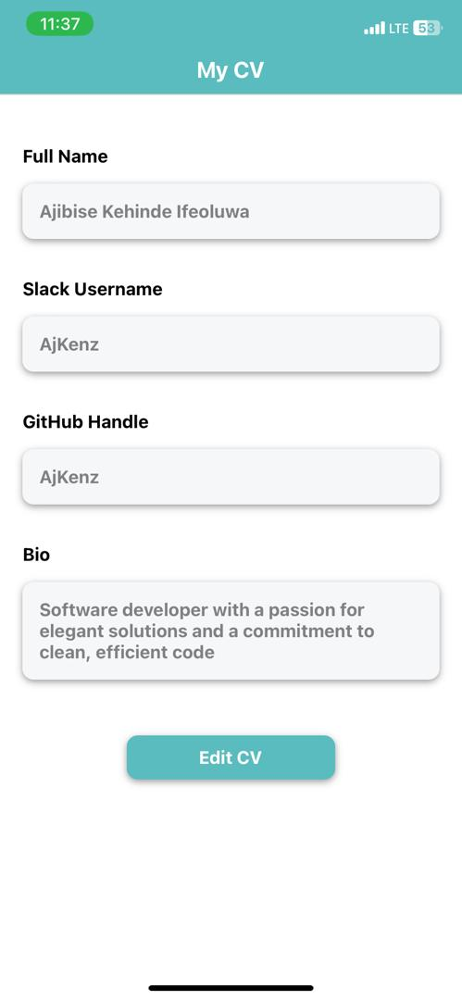
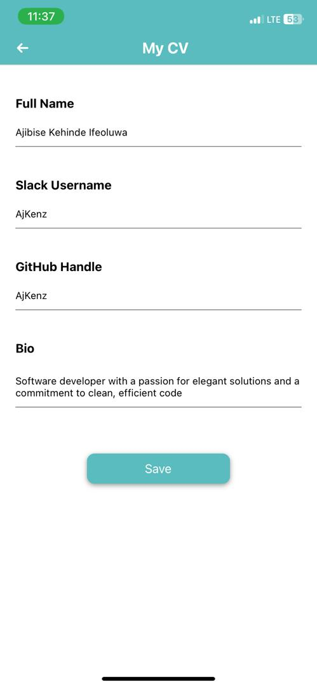

# My CV App

My CV App is a mobile application that allows you to create, view, and edit your personal CV (Curriculum Vitae) right from your mobile device. It provides a clean and organized interface for showcasing your personal and professional details.

## Table of Contents

- [Features](#features)
- [Setup Instructions](#setup-instructions)
- [Usage](#usage)
- [Screenshots](#screenshots)
- [Technologies Used](#technologies-used)
- [Contributing](#contributing)

## Features

- **CV Viewing**: The app displays your full name, Slack username, GitHub handle, and a brief personal bio on the main screen.

- **CV Editing**: You can easily edit your CV by navigating to the edit page, where you can update your details.

- **Real-time Updates**: After making changes to your CV, returning to the main screen immediately reflects the alterations, ensuring a dynamic user experience.

## Appetize

You can test the Slack Identity Mobile App using the Appetize.io Emulator. Below is the link to the emulator:

- [Appetize Link](https://appetize.io/app/l4qhknqj5e32oezvqo4dmyxfii)
- Device: Specify the device name and version that your project works on.

## Setup Instructions

To run the My CV App on your local machine, follow these steps:

1. **Clone the Repository**: 

```bash
git clone https://github.com/AjKenz/Mobile-HNG_stage_2.git
```

2. **Navigate to the Project Directory**:

cd my-cv-app


3. **Install Dependencies**:

```bash
npm install
```

4. **Start the Development Server**:

```bash
npm start
```


5. **Run the App**:
- Use the Expo Go app on your mobile device (iOS or Android) to scan the QR code displayed in the terminal.

## Usage

- Open the app to view your pre-filled CV details.
- Tap the "Edit" button to navigate to the editing page.
- Make changes to your CV details and save them.
- Return to the main screen to see the updated CV.

## Screenshots





## Technologies Used

- React Native
- Expo
- JavaScript

## Contributing

Contributions are welcome! If you'd like to contribute to this project, please follow these guidelines:

1. Fork the repository.
2. Create a new branch for your feature or bug fix.
3. Make your changes and test thoroughly.
4. Commit your changes and create a pull request.
5. Explain the purpose and functionality of your changes in the pull request description.


